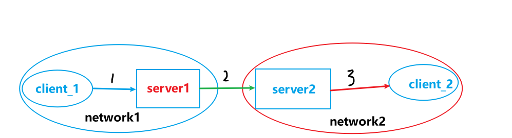

# flutter_simple_websocket
This is a simplified and easy to use websocket communication version, suitable for many business scenarios, only a few lines of code can set up their own websocket server and client side, easy to embed in their own projects, automatic code generation of core classes.


# 使用前说明
* 针对type = "MESSAGE" 类型，采用系统自定义的规则进行，因此如果您要使用该消息类型处理系统，则您需要遵守该MESSAGE消息处理系统的规则
* 如果您 type 消息类型不采用MESSAGE处理系统，您将拥有完全自定义的新消息类型构建权限，开发自由度灵活性更高，具体涵盖从接受消息的解码实现、解码后消息的业务逻辑处理、加密算法实现与消息的发送等更多自由度。
* 如何您需要开发如聊天系统，推荐采用消息类型为MESSAGE的处理系统，这样省去您代码的重构等麻烦。
* 如果您需要完全掌握整个执行流程，不推荐MESSAGE类型消息处理系统来开发。
* 如果您觉得该项目在性能或需求上不满足您，您可以在了解代码继承逻辑后对该项目进行二次开发。

# 项目结构

```markdown
├─bin
│  ├─genOtherClientMsgTypeClass.dart    自动代码生成类:OtherMsgType
│  └─genOtherServerMsgTypeClass.dart    自动代码生成类:OtherClientMsgType
├─lib
│  └─microService        微服务
│      ├─module			 公共
│      │  ├─common      公共功能
│      │  ├─encryption  加解密算法
│      │  ├─manager     管理器
│      │  ├─model       实体模型
│      │  ├─module      模块
│      │  └─websocket   websocket目录
│      └─service         服务功能目录
│          ├─client         客户端client
│          │  ├─common     自动代码生成类文件会存放该目录
│          │  ├─model
│          │  ├─module
│          │  ├─schedule   调度任务: 主要处理各种消息类型的调度发送
│          │  ├─transmit   代理中转目录（包括消息转发等)分为server端和client端转发 推荐server转发 
│          │  └─websocket
│          │      └─messageByTypeHandler   用户自定义消息类型处理类目录
│          └─server         服务端server
│              ├─common        自动代码生成类文件会存放该目录
│              ├─model
│              ├─module
│              ├─schedule       调度任务: 主要处理各种消息类型的调度发送
│              │  └─message       message消息类型处理系统的消息调度
│              ├─transmit       代理中转目录（包括消息转发等) 待开发 推荐server转发
│              └─websocket
│                  └─messageByTypeHandler  用户自定义消息类型处理类目录
└─test                         测试
```

# 类关系图


# 使用规则介绍
分为：MESSAGE消息类型系统和非MESSAGE消息类型自定义处理系统

## MESSAGE消息类型系统

:warning:在初次进行MESSAGE类型消息传输前，一定要先进行AUTH认证，通过之后再进行通讯，否则会异常！

#### 运行逻辑图


**传输消息json**：在client与server之间传递信息的格式要满足如下要求

> 概述：因为该系统主要用sender和recipient的唯一标识符id以及messageId来标识双方websocket信息，来操作执行。

* 格式： json  转为为字符串进行传输

* json字段：

  ```json
  {
      "type": "MESSAGE",  // 消息类型，与消息枚举相同，不区分字母大小写，MESSAGE = Message =.... =message  该字段不加密
      "info": {  
          "msgType": "text", // 消息类型: text,file,link......
          "sender": {  // 发送者
              "id": "user123",// 设备唯一标识：必须唯一，可以为用户名等，只要唯一即可
              "username": "Alice",// 发送者用户名
              "role":  "角色", // admin(管理员), agent(坐席), moderator(版主), user(用户)
              "avatar": "avatar.jpg" // 发送者头像（可选）
          },
          "recipient": { // 接受者
              "id": "all", // 设备唯一标识必须唯一，可以为用户名等，只要唯一即可
              "type": "group" // 接收者类型，例如 group 表示群组消息，user 表示私聊消息
          },
          "content": { // 文本: 
              "text": "Hello, World!", // 文本消息内容
              "attachments": [ // 附件列表，如图片、文件等（可选）
                  {
                      "type": "image", // 文件类型
                      "url": "https://example.com/image.jpg", // 附件链接
                      "name": "image.jpg"   //附件名
                  }]
          },
          "timestamp": "2024-06-14T15:30:00Z", // 发送时间： string 时间格式
          "metadata": {  // 消息元: 用户可以自定义的字段信息
              "messageId": "msg123", // 该消息的唯一标识符：系统回自动生成，或者自己实现必须唯一
              "status": "sent" // 消息状态，例如 sending(正在发送), sent(发送成功，已送达对方), delivered(已送达server端，但未送达对方), read(对方已查阅)
          }
      }
  }
  ```

  > 注意：以上字段在某种**严格意义上的都不是必要字段**，因为MESSAGE类型消息系统也是基于**独立类实现**的（存放于messageByTypeHandler目录中)，所以你可以随意增删改查字段信息。单**type字段必须存在**。

  


## 非MESSAGE消息类型自定义处理系统

#### 运行逻辑图

# 使用说明
您只需要将该项目的覆盖在您的项目即可，主要保留bin、microService目录。
* 克隆
   ```git clone https://github.com/gnu-xiaosong/flutter_simple_websocket ```
* dart package包安装：由于部分原因，我的dart上传不了，等后期解决后。您就可以用pub工具便捷安装了

tip: 更加推荐第一种克隆方式，这样您可以方便重构修改源代码


# 模块

### Server模块

#### 新增自动处理其他类型消息

> 提示：每次在other目录下编写自定义消息类后，都要执行命令以进行自动代码生成

1. 在目录`/lib/microService/service/server/websocket/messageByTypeHandler`下编写server端消息类型处理类

   注意：文件名要与类型一致

2. 类必选函数和参数

   | 必选                                                         | 类型     | 类别 |                                                              |
      | ------------------------------------------------------------ | -------- | ---- | ------------------------------------------------------------ |
   | type                                                         | MsgType  | 属性 | 枚举类型， 具体见OtherMsgType.dart    自定义消息类别 当客户端采用如下格式传输消息文本时，type类型名要与上面生成的枚举名一样 |
   | void handler(HttpRequest request, WebSocket webSocket, Map msgDataTypeMap) | function | 方法 | 处理消息接收处理逻辑：接受参数msgDataTypeMap, clientObject   |

   属性: String type

   方法：

   ```dart
   void handler(HttpRequest request, WebSocket webSocket, Map msgDataTypeMap) {
     //
   }
   ```

   完整：

   ```dart
   /*
   websocket  server与client通讯 自定义消息处理类: TEST消息类型
    */
   import 'package:app_template/microService/service/server/websocket/other/TypeMessageClientHandler.dart';
   
   class TestTypeWebsocketCommunication extends TypeWebsocketCommunication {
     String type = "TEST";
     void handler(msgDataTypeMap, clientObject) {
       //
     }
   }
   ```

   其中**TestTypeMessageServerHandler**为实例文件类，按照该模版编写即可

3. 运行该命令生成代码：切换到项目根目录下

   `dart run .\bin\genOtherServerMsgTypeClass.dart`

**消息类型与文件命名规则说明**：

每一个文件名命名规则为: `驼峰命名消息类型 + TypeMessageHandler`

代执行带生成的时候将会将`TypeMessageHandler`删除，留下剩余部分然后会按照如下规则生成消息枚举常量：

- 单驼峰：直接转变为大写形成枚举

- 多驼峰: 每个驼峰之间增加`_`, 然后再转为大写字母

例子：

- 单驼峰: `TestTypeMessageHandler` --> `Test` -->`TEST`
- 多驼峰: `RequestInlineClientTypeMessageHandler`--> `RequestInlineClient` --> `Request_Inline_Client` -->`REQUEST_INLINE_CLIENT`

提示： 当客户端采用如下格式传输消息文本时，type类型名要与上面生成的枚举名一样

```json
{
   "type": "REQUEST_INLINE_CLIENT", //必选字段,字母不区分大小写，Test = TEST = TeST
   .....  其他可选字段
}
```

> **注意：** 对于具体的加解密算法没有提供，因为取决于client端加密的算法，如果client默认采用的本程序提供的普通消息加解密算法，可以直接调用基类TypeWebsocketCommunication中的enSecretMessage()和deSecretMessage()方法进行加解密，否则只能自己实现加解密算法。

#### 关键核心代码 WebsocketServerManager类使用

```dart
// websocket client instance
WebsocketClientManager websocketClientManager = WebsocketClientManager();


// 启动server
websocketServerManager.setConfig(
    ip: AppConfig.ip,
    port: AppConfig.port,
    whenHasClientConnInterrupt:
    (WebsocketServerManager websocketServerManager,
     ClientObject clientObject) {
        // websocketServerManager  WebsocketServerManager对象
        // clientObject 中断的ClientObject对象
        printError("whenHasClientConnInterrupt: ${clientObject}");
    },
    whenServerError: (WebsocketServerManager websocketServerManager,
                      ErrorObject errorObject) {
        // websocketServerManager  WebsocketServerManager对象
        // errorObject 错误异常ErrorObject对象
        printError("whenServerError: ${errorObject}");
    });
// 启动server
websocketServerManager.boot();
```


### Client模块

#### 新增自动处理其他类型消息

> 提示：每次在other目录下编写自定义消息类后，都要执行命令以进行自动代码生成

1. 在目录`/lib/microService/service/client/websocket/other`下编写server端消息类型处理类

   注意：文件名要与类型一致

2. 类必选函数和参数

   | 必选                                                        | 类型            | 类别 |                                                              |
      | ----------------------------------------------------------- | --------------- | ---- | ------------------------------------------------------------ |
   | type                                                        | MsgType枚举类型 | 属性 | 自定义消息类别， 当客户端采用如下格式传输消息文本时，type类型名要与上面生成的枚举名一样 |
   | void handler(WebSocketChannel? channel, Map msgDataTypeMap) | function        | 方法 | 处理消息接收处理逻辑：接受参数msgDataTypeMap                 |

   属性: String type

   方法：

   ```dart
     void handler(WebSocketChannel? channel, Map msgDataTypeMap) {
       // 解密info字段
       msgDataTypeMap["info"] = decodeAuth(msgDataTypeMap["info"]);
       //处理逻辑
       auth(channel, msgDataTypeMap);
     }
   ```

   完整：

   ```dart
   /*
   websocket  server与client通讯 自定义消息处理类: TEST消息类型
    */
   class TestTypeMessageHandler extends TypeMessageClientHandler {
     MsgType type = MsgType.TEST;
     void handler(WebSocketChannel? channel, Map msgDataTypeMap) {
       //处理逻辑
     }
   }
   ```

   其中**TestTypeMessageHandler**为实例文件类，按照该模版编写即可

3. 运行该命令生成代码：切换到项目根目录下

   `dart run .\bin\genOtherClientMsgTypeClass.dart`

提示： 与server类似使用

> **注意：** 对于具体的加解密算法没有提供，因为取决于client端加密的算法，如果client默认采用的本程序提供的普通消息加解密算法，可以直接调用基类TypeWebsocketCommunication中的enSecretMessage()和deSecretMessage()方法进行加解密，否则只能自己实现加解密算法

#### 关键核心类WebsocketClientManager

```dart
// websocket client instance
WebsocketClientManager websocketClientManager = WebsocketClientManager();

// 启动client
websocketClientManager.setConfig(
ip: ip,
port: AppConfig.port,
whenConnInterrupt: (WebsocketClientManager websocketClientManager) {
//  websocketClientManager  WebsocketClientManager对象
printError("whenConnInterrupt: ${websocketClientManager}");
},
whenClientError: (ErrorObject errorObject) {
// errorObject 错误异常ErrorObject对象,聚体枚举参数见ErrorObject类
printError("whenClientError: ${errorObject}");
});
// 连接
websocketClientManager.conn();
```

# 代理转发系统transmit


#### 代理转发类别方案

- **server端代理转发**： 因为不需要修改太多，按照既定client与server传输消息规则即可，因此**比较推荐**。这样也能降低客户端client的能耗。**半完全的去中心化**。**client单职能，server双职能**

  

- **client端代理转发**：这样会让同一个client端同时连接两个server系统。**半完全的去中心化**。server单职能，client双职能。会**加重client端的负担**。

  

- **完全去中心化（无实际意义的server端）**: **client设备 = server端 + client端**   ，更加偏向于网络化消息传递。缺点：增加client设备的负担，client联通网络， 关键在于如何构建联通网络， 分枝式网络一处异常断开连接会造成后续设备无法正常接受。解决办法构建起互通直达式联通网络。

  > **开发重点**：开发一个直接转发的系统，不需要考虑两个client与server的websocket之间信息交流的问题，该系统来解决这个问题，用户只需要调用即可。

  

  

  **网络结构**

  


**树枝式网络解决办法：动态树枝式网络**，目标：`**已达到接近端到端的通讯目标，实现真正的去中心化**`


**综上所述：**方案三最优，更加接近**端到端通讯**，因为端到端通讯具有**中继节点少**，传输相对快，**数据保障与传输更加安全**。

但也有难点和缺点：在寻找最优有**通讯网络耗时**。

最大的技术难点在于，目前**通讯技术很难实现**，**只能尽可能的减少中继节点**。

两台设备可能不处于同一个网络中，所以**设备与设备无法正真意义上的端到端通讯传播。也不便于审查**。


